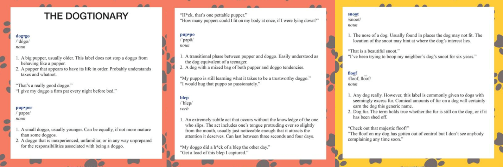
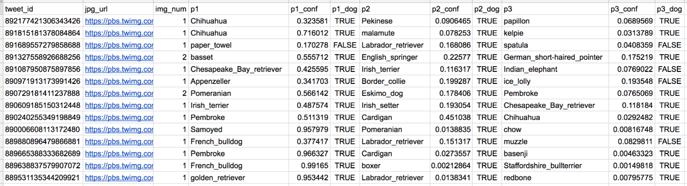

# Project: WeRateDogs - Python, Data Wrangling & Analysis

## Project Details
The main goal here is to wrangle WeRateDogs Twitter data to create interesting and trustworthy analyses and visualizations. Using Python and its 
libraries, data was gathered from various sources and formats, assessed for quality and tidiness, and then cleaned as part of the data wrangling process.

Documentation of wrangling efforts includes showcasing analyses and visualizations using Python and its libraries. The dataset in focus is the tweet archive 
of Twitter user [@dog_rates](https://twitter.com/dog_rates), also known as WeRateDogs. WeRateDogs rates people's dogs with humorous comments, typically with ratings having a denominator of 
10 but numerators often exceeding 10. This practice is based on the belief that "they're good dogs, Brent." WeRateDogs boasts over 4 million followers and 
has garnered international media coverage.

Tasks completed in the [WeRateDogs](https://github.com/CyndiMorris/AnalyticsProjects/blob/main/WeRateDogs/WeRateDogs.ipynb) project:  

* Gathering data  
* Assessing data  
* Cleaning data  
* Storing, analyzing, and visualizing the wrangled data  
* [Wrangling report](https://github.com/CyndiMorris/AnalyticsProjects/blob/main/WeRateDogs/wrangle_report.pdf)
* [Act Report](https://github.com/CyndiMorris/AnalyticsProjects/blob/main/WeRateDogs/act_report.pdf)

## Analysis and Statistics

Question 1:
What are the top 5 most common breeds?
  by tweet, retweet, favorite counts

Question 2:
What is the most popular dog stage?
  by tweet, retweet, favorite counts

Question 3:
What are the top 5 most popular dog names?
  by tweet

## Datasets

**Enhanced Twitter Archive**

The WeRateDogs Twitter archive includes basic tweet data for over 5000 tweets. One column in the archive contains the text of each tweet, which was 
used to extract rating, dog name, and dog stage information, enhancing the dataset. Out of the 5000+ tweets, 2356 have been filtered for containing ratings.

The provided data extraction was done programatically which may have introduced inaccuracies in the ratings, dog names, and dog stages columns. To utilize 
this data for analysis and visualization, it's essential to assess and clean these columns to ensure their accuracy and consistency. Further information on 
each of these columns can help in understanding the issues and devising appropriate cleaning strategies.
 
**Dogtionary**

The Dogtionary explains the various stages of dog: doggo, pupper, puppo, and floof(er)  

**Twitter API**

The Twitter archive lacks columns for retweet count and favorite count, but this data can be obtained from Twitter's API. A WeRateDogs Twitter archive with 
retweet and favorite counts has been provided.

**Image Predictions**

The WeRateDogs Twitter archive was run through a neural network that can classify the breeds of dogs*, resulting in a table full of image predictions (the top 
three only) alongside each tweet ID, image URL, and the image number that corresponded to the most confident prediction (numbered 1 to 4 since tweets can have up to 
four images).

 

Column descriptions:

**p1**: the algorithm's #1 prediction for the image in the tweet → golden retriever  
**p1_conf**: how confident the algorithm is in its #1 prediction → 95%  
**p1_dog**: whether or not the #1 prediction is a breed of dog → TRUE  
**p2**: the algorithm's second most likely prediction → Labrador retriever  
**p2_conf**: how confident the algorithm is in its #2 prediction → 1%  
**p2_dog**: whether or not the #2 prediction is a breed of dog → TRUE  

## Software and Packages

Python  
Pandas  
NumPy  
JSON  
Requests  
Matplotlib  
Seaborn  
Jupyter Notebook

## Files

[twitter_api.py](https://video.udacity-data.com/topher/2018/November/5be5fb4c_twitter-api/twitter-api.py)  
[tweet_json.txt](https://video.udacity-data.com/topher/2018/November/5be5fb7d_tweet-json/tweet-json.txt)  
[twitter_archive_enhanced.csv](https://d17h27t6h515a5.cloudfront.net/topher/2017/August/59a4e958_twitter-archive-enhanced/twitter-archive-enhanced.csv)  
[image_predictions.tsv](https://d17h27t6h515a5.cloudfront.net/topher/2017/August/599fd2ad_image-predictions/image-predictions.tsv)

