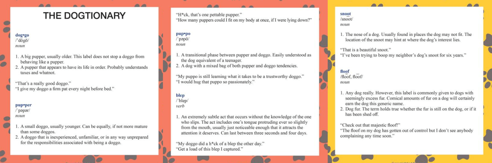

# Introduction

Real-world data rarely comes clean. Here, the main goal is to wrangle WeRateDogs Twitter data to create interesting and trustworthy analyses
and visualizations. Using Python and its libraries, I have gathered data from a variety of sources and in a variety of formats, assessed its 
quality and tidiness, and then cleaned it under the data wrangling process.

Here, with documenting my wrangling efforts, I have also showcased them through analyses and visualizations using Python (and its libraries).

The dataset that I have wrangled (and analyzed and visualized) is the tweet archive of Twitter user @dog_rates, also known as WeRateDogs. 
WeRateDogs is a Twitter account that rates people's dogs with a humorous comment about the dog. These ratings almost always have a denominator 
of 10. The numerators, though? Almost always greater than 10. 11/10, 12/10, 13/10, etc. Why? Because "they're good dogs Brent." WeRateDogs has 
over 4 million followers and has received international media coverage.

## Project Details

Tasks in this project are as follows:  

* Gathering data  
* Assessing data  
* Cleaning data  
* Storing, analyzing, and visualizing the wrangled data  
* Wrangling report
* Analysis and Visualization report

## Datasets

**Enhanced Twitter Archive**

The WeRateDogs Twitter archive includes basic tweet data for over 5000 tweets. One column in the archive contains the text of each tweet, which was 
used to extract rating, dog name, and dog stage information, enhancing the dataset. Out of the 5000+ tweets, 2356 have been filtered for containing ratings.
 
**Extracted data from tweet text**

The provided data extraction was done programatically which may have introduced inaccuracies in the ratings, dog names, and dog stages columns. To utilize 
this data for analysis and visualization, it's essential to assess and clean these columns to ensure their accuracy and consistency. Further information on 
each of these columns can help in understanding the issues and devising appropriate cleaning strategies.
 
**Dogtionary**

The Dogtionary explains the various stages of dog: doggo, pupper, puppo, and floof(er)  

**Twitter API**

The Twitter archive lacks columns for retweet count and favorite count, but this data can be obtained from Twitter's API. A WeRateDogs Twitter archive with 
retweet and favorite counts has been provided.

**Image Predictions File**

One more cool thing: I ran every image in the WeRateDogs Twitter archive through a neural network(opens in a new tab) that can classify breeds of dogs*. The results: a table full of image predictions (the top three only) alongside each tweet ID, image URL, and the image number that corresponded to the most confident prediction (numbered 1 to 4 since tweets can have up to four images).
 
**Image predictions**

Tweet image prediction data

So for the last row in that table:

tweet_id is the last part of the tweet URL after "status/" → https://twitter.com/dog_rates/status/889531135344209921(opens in a new tab)
p1 is the algorithm's #1 prediction for the image in the tweet → golden retriever
p1_conf is how confident the algorithm is in its #1 prediction → 95%
p1_dog is whether or not the #1 prediction is a breed of dog → TRUE
p2 is the algorithm's second most likely prediction → Labrador retriever
p2_conf is how confident the algorithm is in its #2 prediction → 1%
p2_dog is whether or not the #2 prediction is a breed of dog → TRUE
etc.

  
twitter-archive-enhanced.csv: Given archived dataset for dog ratings scraped via tweet
wrangle_act.ipynb: The Jupyter notebook consisting of all Data Wrangling steps
wrangle_report.html: The final report in slides format of the wrangle_act.ipynb
twitter_archive_master.csv: Final cleaned tweets with all databases combined (containes no retweets or replies)
final_retweets.csv: Final cleaned retweets
final_replies.csv: Final cleaned replies
tweet_json.csv, tweet_json.txt and image-predictions.tsv created in intermediate steps of Data Gathering
analysis.ipynb: Jupyter notebook consisiting of basic initial analysis of the final twitter_archive_master.csv
act_report.html: The final report in slides format of analysis.ipynb

## Softwares and Packages

Python
pandas  
NumPy  
requests  
tweepy  
json  
matplotlib
seaborn
requests

## References
Reading and writing json to a file

Unique Rating System of WeRateDogs

Tidy Data Rules
